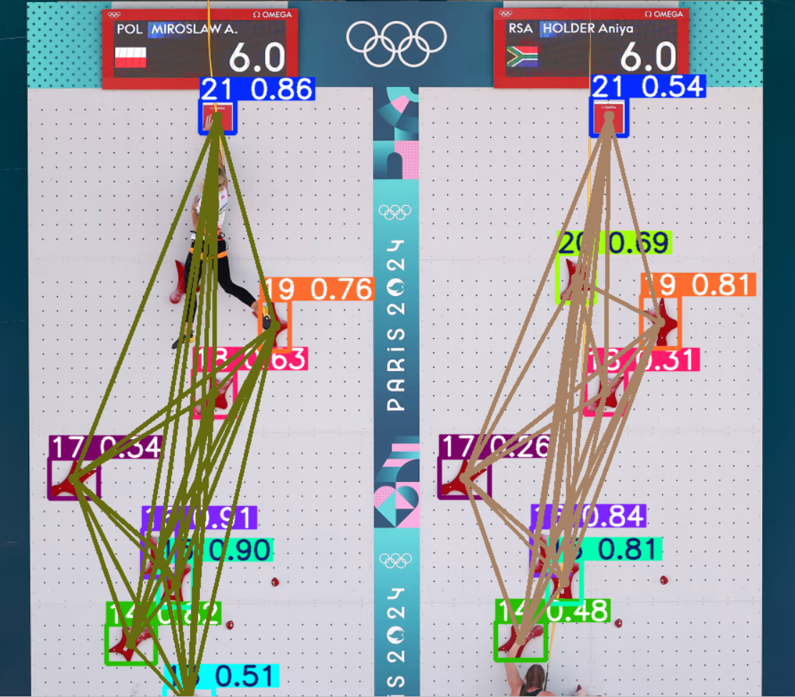
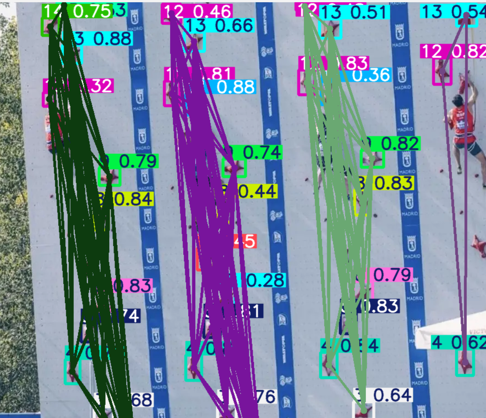
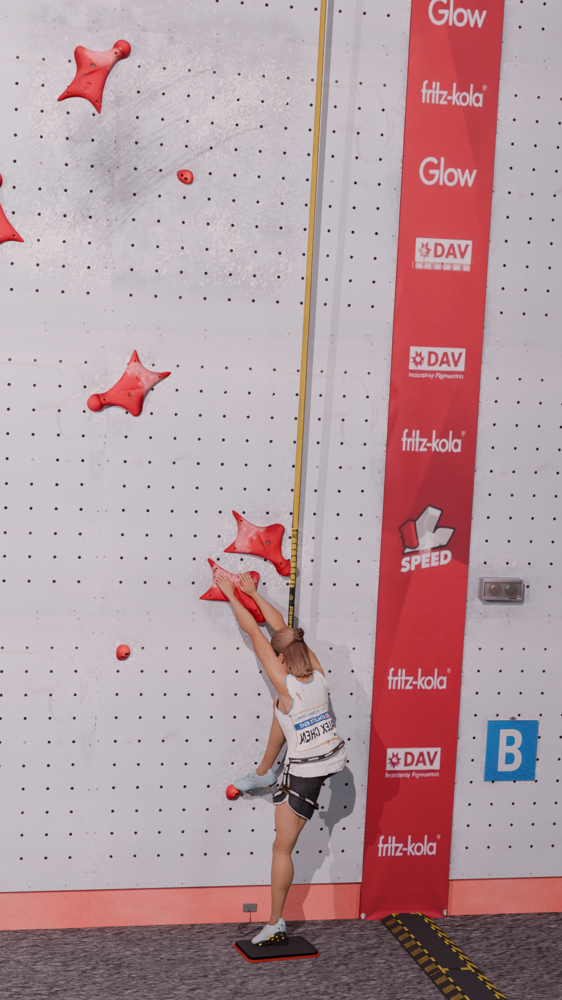
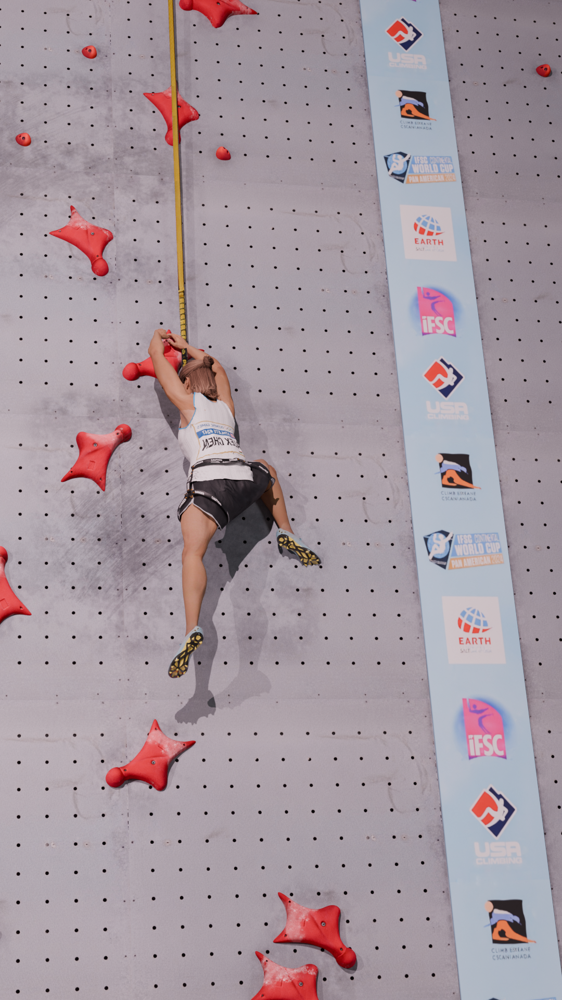
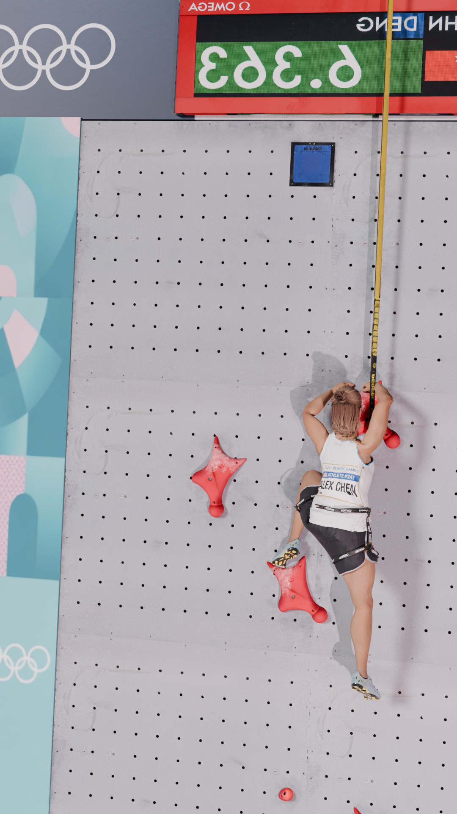

# ClimbVision: Computer Vision-Based Speed Climbing Performance Tracking



A computer vision system for analyzing speed climbing performances using deep learning, multi-lane tracking, and biomechanical analysis. The project combines **YOLOv8 object detection**, **MediaPipe pose estimation** and homography, **DBSCAN clustering**, and **Kalman filtering** to extract precise climber metrics from offline video footage.

**Language**: Python 3.10+ | **GPU Optimized**: CUDA 11.8+ | **License**: Open Source

---

##  Overview

**Speed climbing** is a sport where athletes compete on standardized climbing walls. This system automates performance analysis by:

-  **Detecting climbing holds** from offline footage using a fine-tuned YOLOv8 model
-  **Tracking climber pose** with MediaPipe for biomechanical insights
-  **Mapping 2D image coordinates to 3D world space** using homography and PnP (Perspective-n-Point) transforms
-  **Smoothing trajectories** with Kalman filtering and Butterworth low-pass filters
-  **Computing velocity profiles** for speed and acceleration analysis
- **Processing multiple video streams** with async task queuing
-  **Visualizing results** through an interactive web interface

The system processes climbing videos in **20-30ms per frame on GPU (RTX 3090)** vs **380ms on CPU**, achieving **15-20x acceleration** with NVIDIA hardware using quantization.

---

##  Architecture

### System Components

```
┌─────────────────────────────────────────────────────────────┐
│                    Web UI (React/HTML)                      │
│              analysis_viewer.html - Chart.js                │
└──────────────────┬──────────────────────────────────────────┘
                   │ HTTP/WebSocket
┌──────────────────▼──────────────────────────────────────────┐
│              FastAPI Backend                                │
│          server/main.py - Video Upload API                  │
└──────────────────┬──────────────────────────────────────────┘
                   │ Task Queue (Redis)
┌──────────────────▼──────────────────────────────────────────┐
│            Celery Worker Pool                               │
│     server/tasks.py - Analysis Pipeline                     │
└──────────────────-───────────┬──────────────────────────────┘
			                   │
			    ┌──────────────┼──────────────┐
			    │              │              │
			┌───▼──┐  ┌───────▼────┐  ┌──────▼───┐
			│YOLO8 │  │ MediaPipe  │  │ Decord   │
			│Detect│  │ Pose Est.  │  │ Video IO │
			└───┬──┘  └───────┬────┘  └──────┬───┘
			    │             │              │
			    └─────────────┼──────────────┘
			                  │
			        ┌─────────▼──────────┐
			        │ PnP Homography     │
			        │ Coordinate Mapping │
			        └─────────┬──────────┘
			                  │
			        ┌─────────▼──────────┐
			        │ Kalman Filter      │
			        │ Butterworth LPF    │
			        │ Smoothing          │
			        └─────────┬──────────┘
			                  │
			        ┌─────────▼──────────┐
			        │ JSON Results       │
			        │ Metrics Export     │
			        └────────────────────┘
```

### Data Flow

1. **Upload**: User uploads climbing video(s) via web interface
2. **Queueing**: FastAPI stores videos in temp directory, queues Celery task
3. **Detection**: YOLO detects climbing holds in each frame
4. **Pose**: MediaPipe extracts 33 body landmarks (climber posture)
5. **Mapping**: Homography/PnP transforms 2D detections to 3D world coordinates
6. **Smoothing**: Kalman filter and butterworth low-pass filters refine trajectories
7. **Analysis**: Velocity and acceleration computed from smoothed positions
8. **Visualization**: Results streamed to web UI in real-time

---

##  Core Modules

###  YOLOv8 Object Detection

**Model**: YOLOv8 (You Only Look Once v8) - Fine-tuned on climbing holds
### Pose Estimation: MediaPipe Pose

**Model**: MediaPipe Pose (heavy) - 33 body landmarks

- **Landmarks**: Head, shoulders, elbows, wrists, hips, knees, ankles, toes
- **Output**: (x, y, z, visibility) for each landmark, 2d skeleton is extracted for position estimation

### Coordinate Mapping: Homography & PnP

**Solution**: Transform 2D image coordinates → 3D world coordinates

#### Known Grip Positions (Ground Truth)

IFSC tournament walls have **21 standardized grip positions** with precise 3D locations:

```python
# Example grip specifications (from IFSC regulations)
"""
1] @F2-SN2#1    2] @G2-SN2#3    3] @A2-SN2#9
4] @G1-SN3#4    5] @L1-SN3#10   6] @C2-SN4#2
...
21] @A2-SN10#10
"""
```

Grid: **3.0m wide × 15.0m tall** (standard IFSC wall), position is computed relative to the standard table base. 

### Homography Transform and heuristics
The processing pipeline employs different estimation techniques based on the amount of grips extracted by the previous stage.
When 4+ grips detected: PnP is employed for its robustness to camera persepctive, handling tilted camera angles. 
When 3 grips are detected, an affine transform is used which is less robust but can still handle scale and affine transforms. 
When less than 3 grips are estimated, we use the average bounding box to compute the observed world scale and use a vector heuristic to compute a probable position. 

#### Smoothing: Kalman Filter + Butterworth LPF, frequencies which are beyond usual human kinetics are filtered out


## Multi-Lane Tracking & Clustering (DBSCAN)



### Challenge: Multiple Climbing Lanes

Competition venues have **multiple lanes** (typically 2-3) where climbers compete simultaneously. The system must:

1. Track each climber in their respective lane
2. Avoid cross-lane interference
3. Maintain identity across occlusions

### DBSCAN Clustering Solution

**Why DBSCAN?**

- No need to specify number of clusters (k-means requires this), can use the inferred grip size as parameter for clustering
- Robust to noise (outlier detections)
- Works with arbitrary cluster shapes
- Handles multi-lane scenarios naturally, due to lanes being physically separated and grips belonging to the same lane being relatively close when projected in the x direction of the camera shot. 

---

##  Synthetic Data Generation & Validation (Blender)

### Why Synthetic Data?

Training YOLOv8 on real climbing footage is expensive:

- Manual annotation of holds (thousands of frames)
- Weather variability, lighting conditions
- Limited real-world dataset diversity

**Synthetic advantages**:

- Perfect annotations (automatic bounding boxes)
- Unlimited variations (camera angles, lighting, holds)
- Repeatable, deterministic
- Easy to generate specialized scenarios

### Blender Pipeline
On the ground         |  Mid climb			| Near top
:-------------------------:|:--------------------------:|:-------------------------:
  |   | 

**Blender 3D** is used to:

1. Model standardized IFSC climbing wall with all 21 holds
2. Simulate realistic camera angles and movements
3. Render photo-realistic climbing videos with varied conditions
4. Export ground-truth bounding box annotations in YOLO format

---

##  User Interface

### Web-Based Analysis Viewer

**Technology**: HTML5 + Chart.js + Responsive Design
#### Features

1. **Video Upload Form**
    
    - Drag-and-drop support
    - Dual video comparison (Climber A vs Climber B)
    - Progress bar during analysis
    - File validation
2. **Real-Time Analysis Status**
    
    - Job queue position
    - Frame processing progress
    - Kalman filtering stage indicator
    - ETA estimation
3. **Interactive Charts**
    
    - Height (Y) trajectory over time
    - Velocity profile comparison
    - Comparative analysis (two climbers)
    - Zoomable timeline
    - Hover tooltips with precise values
4. **Metrics Dashboard**
    
    - Average velocity (m/s)
    - Peak velocity
    - Climb duration
    - Confidence score
    - Detection statistics
---

##  How to start

#### Prerequisites

- Python 3.10+
- CUDA 11.8+ (optional, for GPU)
- Redis server
- 10GB+ free disk space

#### Installation

```bash
# 1. Clone repository
git clone https://github.com/marcozeccola/speed-analysis.git
cd speed-analysis

# 2. Create conda environment
conda env create -f environment.yml
conda activate speed-analysis

# 3. Install dependencies
pip install -r server/requirements.txt

# 4. Obtain YOLOv8 model
# Download fine-tuned model and place at: server/best.pt
# (Or train your own with: yolo train detect data=climbing.yaml)

# 5. Start Redis
redis-server --daemonize yes

# 6. Start Celery worker (solo mode for development)
cd server
celery -A tasks worker -l info -P solo &

# 7. Start FastAPI server
uvicorn main:app --reload --port 8000

# 8. Open browser
open http://127.0.0.1:8000/viewer
```

---
### Key Files Explained

**main.py** (FastAPI Backend)

- `POST /api/analyze-videos/`: Accept video uploads
- `GET /api/analysis-status/{job_id}`: Poll task status
- `GET /viewer`: Serve web UI

**tasks.py** (Analysis Engine)

- `analyze_climbing_videos_task()`: Main orchestrator
- `act()`: Single-video processing pipeline
- `var_n_pnp_solve()`: Homography/PnP transformation
- `compute_mp_pose_com()`: Pose landmark extraction
- `suppress_border_detection()`: Filter out-of-wall detections

**analysis_viewer.html** (Frontend)

- Form submission and file upload
- Progress polling loop
- Chart.js visualization (height, velocity)
- Comparative analysis (2 climbers)
- Real-time status updates

##  License & Attribution

**License**: Open Source (MIT License)

**Dependencies**:

- YOLOv8 (Ultralytics) - AGPL-3.0
- MediaPipe (Google) - Apache 2.0
- FastAPI (Tiangolo) - MIT
- Celery (ASF) - BSD
- PyKalman (Rainer Hegger) - BSD
- OpenCV (OpenCV team) - Apache 2.0
